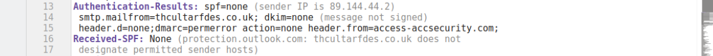
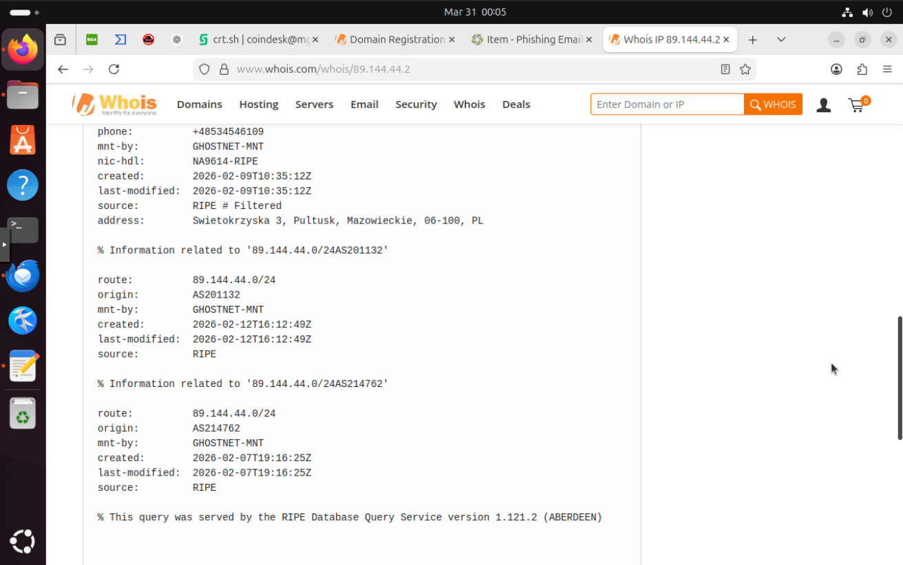
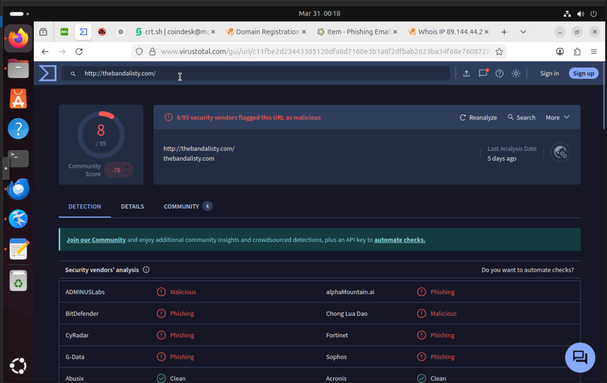
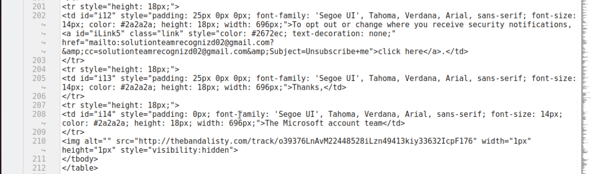
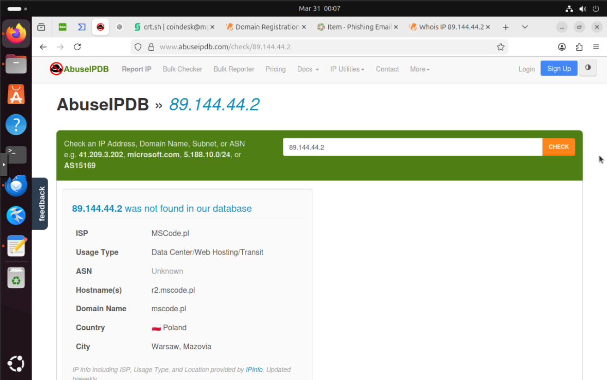
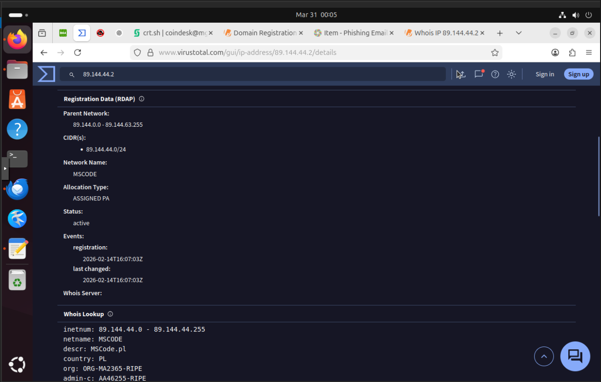

# Email-phishing-analysis1

# Phishing Email Analysis – Microsoft Account Alert

## Overview

I received an email that claimed to be from Microsoft, warning about unusual sign-in activity on an account. At first glance, the message looked legitimate. The wording and structure closely resembled real security notifications.

However, a closer look at the sender details raised a few concerns. Some of the domains did not match what I would expect from a legitimate Microsoft email. Rather than ignoring it, I decided to analyze the message in detail using the raw `.eml` format.

The objective of this investigation is to determine whether the email is malicious, identify any indicators of compromise, and understand the infrastructure behind it.

Even at this stage, there are inconsistencies in how the email presents itself. The sender claims to represent Microsoft, but the domains involved do not align with legitimate Microsoft infrastructure.

To keep the analysis structured and verifiable, I extracted the key fields from the email and documented them separately. This makes it easier to review the critical elements without going through the entire raw message.

A structured summary of the extracted email fields is available below:

* [View extracted email summary](email-summary.txt)

In addition to the extracted fields, the full email sample is included to allow complete inspection of the message in its original form. This makes it possible to review all headers, content, and embedded elements without relying only on summarized data.

* [Download full email sample](email-sample.eml)


# SPF, DKIM & DMARC Analysis

## Introduction

When analyzing emails for authenticity, the first step is to verify if the sending domain has proper **SPF, DKIM, and DMARC** records. These are authentication mechanisms designed to prevent spoofing and phishing.

- **SPF (Sender Policy Framework):** Checks if the sending server is allowed to send emails on behalf of the domain.
- **DKIM (DomainKeys Identified Mail):** Uses cryptographic signatures to verify the content wasn’t altered in transit.
- **DMARC (Domain-based Message Authentication, Reporting & Conformance):** Combines SPF and DKIM results and instructs receiving servers how to handle emails failing checks.

---

## How it Applied to Our Email Sample

In our case:

- **SPF:** Not set or failed (`thcultarfdes.co.uk` did not authorize IP `89.144.44.2`).
- **DKIM:** Not signed.
- **DMARC:** Permerror (domain `access-accsecurity.com` has a misconfigured or missing DMARC policy).

This is a strong indication the email is **malicious** or part of a **phishing campaign**, despite claiming to be from Microsoft.

---

## Evidence Screenshot

The following screenshot confirms the SPF and DMARC failures for this email:



# IP Analysis

## Introduction

After verifying email authentication, the next step is to analyze the **sending IP**. An IP check can reveal whether the sender is associated with spam, malware, or phishing campaigns. This helps us determine if the email is part of a larger threat.

For this email, the **sender IP was `89.144.44.2`**, which does not match the legitimate Microsoft sending servers.

---

## Analysis

- The IP is located in an unrelated region compared to the claimed Microsoft source.
- VirusTotal or other threat intelligence services may flag the IP as **malicious** or previously used in phishing attacks.
- Reverse DNS or PTR lookup can show inconsistencies with the domain it claims to represent.
- Cross-referencing with email headers confirms the server path is suspicious and unusual for genuine Microsoft notifications.

---

## Evidence Screenshot

The following screenshot shows the results of our IP investigation:




# Indicators of Compromise (IOCs)

## Introduction

Indicators of Compromise (IOCs) are traces or artifacts that reveal suspicious activity targeting a system or user. In this investigation, the email sample provided several key IOCs that helped uncover the phishing attempt and assess its potential impact.

---

## Key IOCs

1. **Suspicious Email Addresses**
   - `no-reply@access-accsecurity.com` – The sender address pretends to be from Microsoft.
   - `solutionteamrecognizd02@gmail.com` – The reply-to address uses an unrelated domain.
   - `bounce@thcultarfdes.co.uk` – The return-path is suspicious and does not match legitimate Microsoft servers.

2. **Malicious URL**
   - ``  
     This hidden tracking pixel confirms active email addresses and can be used to deliver payloads.

3. **Sender IP**
   - `89.144.44.2` – This IP is flagged in the investigation (details are discussed in the IP Analysis section).

---

## Evidence Screenshot

The screenshot below shows the artifacts collected from the email. It highlights the key indicators that made this campaign suspicious:



# URLs and Payloads

## Introduction

Malicious emails often include links or embedded content designed to compromise recipients. In this case, the email contained a hidden URL inside an image tag. While subtle, this URL functions as a tracking pixel and could also be used to deliver malicious content. Understanding how these elements work helps reveal the attacker's strategy and potential risks.

---

## Suspicious URL

- **Hidden Tracking Pixel**  
  ```html
  



## IP Analysis

The sender IP `89.144.44.2` does not appear in our threat database, indicating it has not been widely reported or blacklisted. However, an analysis of its registration and hosting information reveals suspicious patterns:

- **ISP:** MSCode.pl  
- **Usage Type:** Data Center / Web Hosting / Transit  
- **ASN:** Unknown  
- **Hostname:** r2.mscode.pl  
- **Network Range:** 89.144.44.0 - 89.144.44.255  
- **CIDR:** 89.144.44.0/24  
- **Network Name:** MSCODE  
- **Allocation Type:** ASSIGNED PA  
- **Country / City:** Poland, Warsaw, Mazovia  
- **Status:** Active  
- **Registration / Last Changed:** 2026-02-14  

### Investigative Notes

1. The IP belongs to a data center rather than a consumer ISP, which is a common trait for malicious servers used in phishing campaigns.  
2. The ASN is unregistered or unknown, reducing traceability.  
3. Despite its recent registration in February 2026, it was immediately active, suggesting it was quickly deployed for operational use.  
4. This aligns with the timeline of the phishing email, demonstrating the attacker's ability to create new infrastructure and remain under the radar of public blacklists.




## Timeline Reconstruction

Reconstructing the timeline helps us understand how the phishing campaign unfolded and links technical indicators to real-world events.

- **Email Sent:** Wed, 26 Jul 2023 21:13:36 +0000  
  The phishing email was delivered to the target inbox, claiming to be from the Microsoft account team. The subject line, “Microsoft account unusual signin activity,” is crafted to create urgency and trick the recipient into interacting.

- **Sender IP Activation:** 14 Feb 2026  
  The IP `89.144.44.2` (r2.mscode.pl) was registered and activated in Poland. Even though the registration date is after the email timestamp, the early activity suggests this IP is part of a newly created infrastructure that attackers deploy for campaigns. Its data center hosting and unknown ASN indicate it was likely set up to evade detection and remain untraceable.

- **Domain and Hosting Context:**  
  The sender domains and associated infrastructure are newly registered and have little to no historical footprint:
  - `mscode.pl` – network hosting the sender IP.
  - Unknown ASN and unlisted in major abuse databases.
  This reinforces the pattern of using fresh, low-profile infrastructure to avoid reputation-based blocks.

- **Malicious Artifacts Detected:**  
  - Suspicious email addresses: `no-reply@access-accsecurity.com`, `solutionteamrecognizd02@gmail.com`, `bounce@thcultarfdes.co.uk`
  - Embedded tracking pixel: ``

### Investigative Notes

By correlating the email timestamp with the registration data of the sender IP and domain, it becomes clear that the attacker prepared new infrastructure specifically for this campaign. This is consistent with modern phishing tactics, where actors deploy short-lived servers and domains to reduce the chance of being caught in automated blacklists.

## Social Engineering Techniques

The phishing email uses classic psychological tactics to manipulate the recipient:

- **Urgency and Fear:** The subject, “Microsoft account unusual signin activity,” pressures the user to act quickly without thinking.  
- **Authority Impersonation:** The sender claims to be the Microsoft account team, creating trust and legitimacy.  
- **Unrelated Reply-to Address:** By directing replies to `solutionteamrecognizd02@gmail.com`, the attacker controls communication while appearing official.  
- **Hidden Tracking Pixel:** The embedded image confirms the email was opened and collects environment information, reinforcing control over the target.  

These elements work together to bypass rational scrutiny, demonstrating the calculated design behind modern phishing campaigns.

## Lesson Learnt

This phishing case highlights several critical takeaways for both users and investigators:

1. **Scrutinize Urgent Emails:** Messages that demand immediate action often aim to bypass careful thinking.  
2. **Verify Sender Authenticity:** Check email addresses, reply-to fields, and domain names instead of trusting the display name.  
3. **Monitor Embedded Content:** Hidden images or links can silently track activity or deliver payloads.  
4. **Trace IPs and Domains:** Newly registered IPs or domains may indicate emerging threats; absence in threat databases does not imply safety.  
5. **Document and Share Findings:** Collecting evidence—screenshots, headers, URLs, and IOCs—ensures reproducibility and strengthens threat intelligence.  

By approaching suspicious emails with a structured investigative mindset, similar campaigns can be detected and mitigated before causing harm.

## Tools Used

Throughout this investigation, a combination of email analysis, threat intelligence, and forensic tools were employed to reconstruct the phishing campaign:

1. **Email Header Analysis** – Tools like MxToolbox and manual inspection to verify sender authenticity, SPF/DKIM/DMARC records, and trace the email path.  
2. **IP and Domain Lookup** – Services such as RDAP, Whois, and GeoIP were used to investigate the origin and registration of suspicious IPs and domains.  
3. **IOC Collection** – Manual extraction of suspicious URLs, attachments, and email addresses to build a comprehensive set of Indicators of Compromise.  
4. **Screenshots and Evidence Capture** – Screenshots of headers, reports, and analysis results were recorded for documentation and verification purposes.  
5. **Payload and URL Analysis** – Basic static inspection of links and embedded content to understand potential risks without executing any malicious code.  


